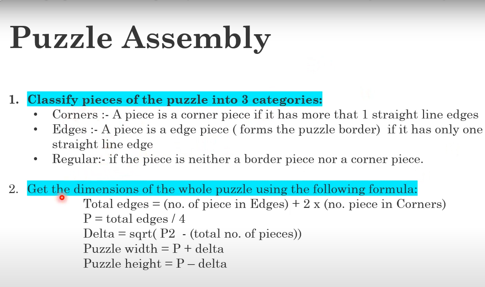

# MDMV Puzzle Solver

A computer vision project for Model Driven Machine Vision (Course 206.2), lectured by Professor Louis Lettry at HES-SO Valais-Wallis.

This project implements an advanced puzzle solver pipeline that detects, analyzes, and assembles jigsaw puzzle pieces from images using computer vision and machine learning techniques.

## Features

- **Robust Piece Detection**: Automatically segments individual puzzle pieces from images with dark backgrounds
- **Corner Detection**: Advanced corner detection using distance transforms and contour analysis
- **Edge Analysis**: Classifies edges as straight, intrusion (tabs), or extrusion (slots)
- **Feature Extraction**: Extracts both shape and color features from puzzle piece edges
- **Smart Matching**: Uses DTW (Dynamic Time Warping) color sequence matching and shape compatibility
- **Automatic Assembly**: Assembles puzzles with backtracking, dynamic thresholds, and rotation support
- **Performance Optimization**: Multiprocessing support, Numba JIT compilation, and intelligent caching

## Pipeline Overview

<div align="center">

</div>

The complete pipeline consists of five stages:

### 1. Segmentation
- Detects individual puzzle pieces from input images
- Uses adaptive thresholding and morphological operations
- Filters contours based on area to remove noise
- Extracts pieces with proper mask application

### 2. Edge Extraction
- Identifies corners using distance transforms
- Extracts edges between consecutive corners
- Applies smoothing and refinement to contours
- Tracks edge orientation and connectivity

### 3. Feature Extraction

**Shape Features:**
- Classifies edges as straight, intrusion (inward), or extrusion (outward)
- Calculates deviation metrics from reference lines
- Provides compatibility scoring for complementary edges

**Color Features:**
- Extracts color sequences along edges
- Uses LAB color space for perceptual accuracy
- Implements spatial awareness with segmented analysis
- Calculates color transitions and gradients

### 4. Edge Matching
- Computes shape compatibility scores
- Uses Dynamic Time Warping for color sequence matching
- Combines shape and color scores with weighted averaging
- Implements bidirectional matching for improved accuracy

### 5. Puzzle Assembly
- Uses intelligent starting piece selection
- Implements backtracking for dead-end recovery
- Supports dynamic threshold adjustment
- Handles piece rotation (0°, 90°, 180°, 270°)
- Validates assembly using piece classification constraints

## Installation

```bash
# Clone the repository
git clone https://github.com/jijiduc/mdmv-puzzle-solver
cd mdmv-puzzle-solver

# Create virtual environment
python -m venv venv
source venv/bin/activate  # On Windows: venv\Scripts\activate

# Install dependencies
pip install -r requirements.txt
```

### Optional Dependencies

For enhanced performance:
```bash
pip install numba  # JIT compilation for speed
pip install psutil  # System resource monitoring
```

## Usage

### Basic Usage

```bash
# Run edge matching and assembly on a puzzle image
python edges_matching.py

# Segment pieces only (no assembly)
python segmentation_only.py

# Run with specific configuration
python main.py --image picture/puzzle_24-1/b-2.jpg --pieces 24
```

### Advanced Usage

With full configuration options:

```bash
python main.py --image puzzle.jpg \
    --pieces 24 \
    --debug \
    --extract \
    --view \
    --use-multiprocessing \
    --area-verification \
    --detection-method hybrid
```

### Available Arguments

- `--image`: Path to the puzzle image (required)
- `--pieces`: Expected number of pieces
- `--debug`: Enable debug mode with image outputs
- `--extract`: Extract individual pieces to separate files
- `--view`: Display results in windows
- `--fast-mode`: Use fast detection mode
- `--use-multiprocessing`: Enable parallel processing
- `--processes`: Number of processes (0 = auto)
- `--min-area`: Minimum piece area in pixels²
- `--area-verification`: Enable area-based verification
- `--detection-method`: Choose detection method (standard/simple/watershed/hybrid)

## Input Requirements

- Images should have dark backgrounds for optimal segmentation
- Pieces should be clearly separated (not overlapping)
- Good lighting conditions for consistent color detection
- Supported formats: JPG, PNG, and other OpenCV-compatible formats

## Output

The solver generates several outputs:

1. **Assembly Result**: Final assembled puzzle image
2. **Debug Images**: Edge detection, corners, features (when debug enabled)
3. **Metrics Report**: Assembly statistics and confidence scores
4. **Individual Pieces**: Extracted piece images (when extraction enabled)

Example output structure:
```
output/
├── assembled_puzzle.png
├── debug/
│   ├── corners/
│   ├── edges/
│   ├── features/
│   └── transforms/
├── extracted_pieces/
│   ├── piece_0.png
│   ├── piece_1.png
│   └── ...
└── metrics_report.txt
```

## Key Algorithms

### Corner Detection
- Uses distance transforms to identify corner features
- Analyzes contour points' distances from centroid
- Employs peak detection on distance functions
- Validates corners based on angular relationships

### Edge Shape Analysis
- Calculates deviations from reference lines
- Classifies edges using adaptive thresholds
- Provides continuous metrics for matching

### DTW Color Matching
- Extracts color sequences with confidence weighting
- Uses Dynamic Time Warping for sequence alignment
- Handles edge length variations gracefully
- Performs bidirectional matching

### Assembly Algorithm
- Implements intelligent seed piece selection
- Uses frontier-based expansion
- Supports backtracking for recovery
- Adjusts thresholds dynamically

## Performance Optimization

The system includes several performance enhancements:

- **Parallel Processing**: Multi-core utilization for piece processing
- **Numba Acceleration**: JIT compilation for numerical operations
- **Memory Management**: Efficient handling of large images
- **Caching**: Results caching to avoid redundant calculations

## Configuration

Key configuration parameters can be found in:

```python
# corners.py / edges_matching.py
INPUT_PATH = "picture/puzzle_24-1/b-2.jpg"
THRESHOLD_VALUE = 135
MIN_CONTOUR_AREA = 150

# Assembly parameters
INITIAL_THRESHOLD = 0.7
MIN_THRESHOLD = 0.3
THRESHOLD_STEP = 0.05
```

## Troubleshooting

### Common Issues

1. **Poor Segmentation**: Adjust `THRESHOLD_VALUE` for your lighting conditions
2. **Missing Pieces**: Lower `MIN_CONTOUR_AREA` to detect smaller pieces
3. **Wrong Assembly**: Tune shape/color weights or initial threshold
4. **Memory Issues**: Reduce batch size or enable multiprocessing

### Debug Mode

Enable debug output to diagnose issues:
```bash
python edges_matching.py --debug
```

This generates intermediate visualizations for each pipeline stage.

## Future Improvements

- Machine learning-based feature extraction
- Hausdorff distance for shape matching
- Procrustes analysis for alignment
- Texture feature integration
- Global constraint optimization
- Real-time assembly preview

## Project Structure

```
mdmv-puzzle-solver/
├── main.py                 # Main entry point
├── edges_matching.py       # Complete pipeline implementation
├── corners.py              # Corner detection module
├── segmentation_only.py    # Segmentation-only tool
├── picture/                # Input images
│   ├── puzzle_24-1/
│   ├── puzzle_49-1/
│   └── ...
├── ideas/                  # Design documents
│   ├── assembly.txt
│   ├── corners_detection.txt
│   └── matching.txt
├── debug/                  # Debug output directory
├── requirements.txt        # Python dependencies
└── README.md              # This file
```

## Team Members

- [Jeremy Duc](https://github.com/jijiduc) 
- [Alexandre Venturi](https://github.com/mastermeter)

## References

- [Project Description](https://isc.hevs.ch/learn/pluginfile.php/5191/mod_resource/content/0/Project.pdf) - Official course project specification
- OpenCV Documentation
- Research papers on puzzle solving and edge matching techniques

## License

This project is part of the Model Driven Machine Vision course at HES-SO Valais-Wallis.